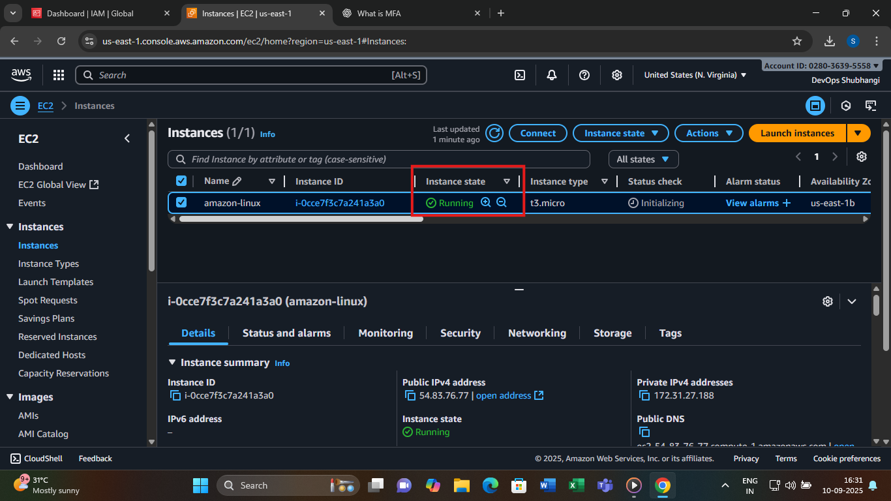
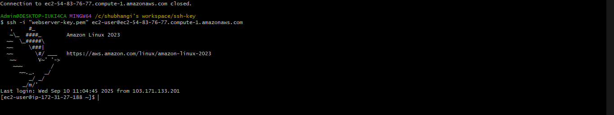
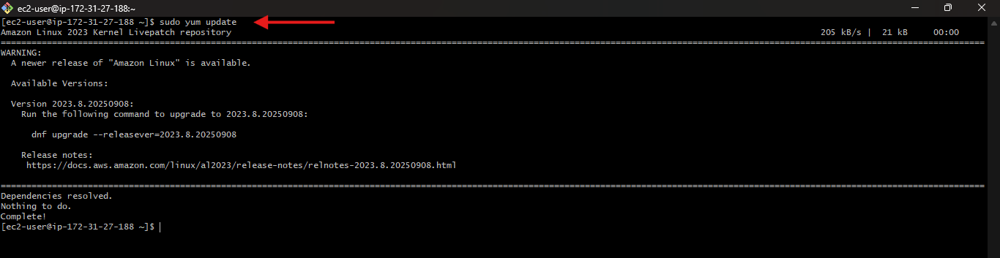
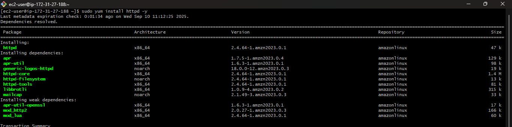
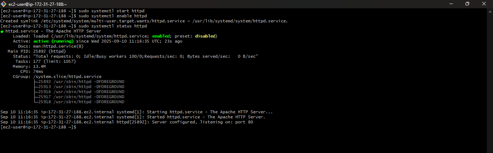
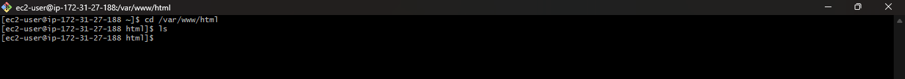
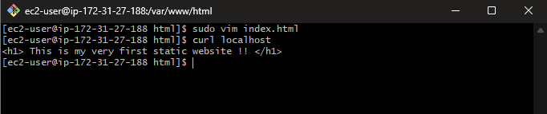
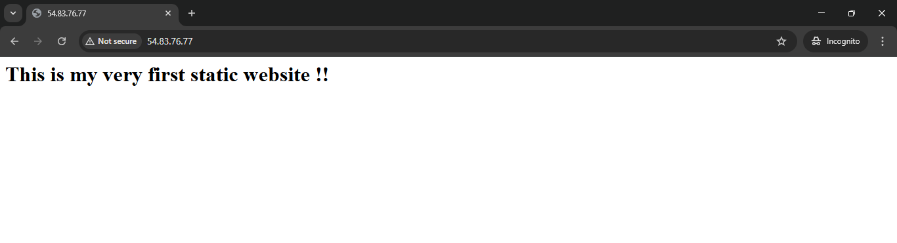
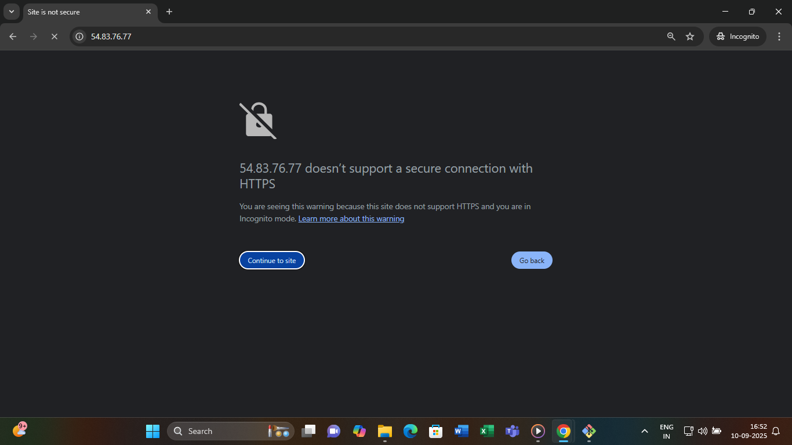
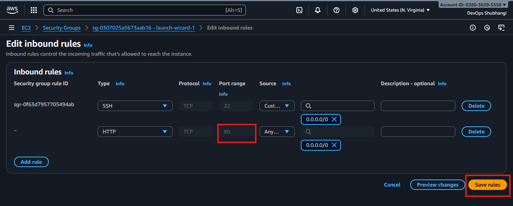

# Hosting a Static Website on Amazon Linux AMI with Apache (httpd)

This guide walks you through setting up and hosting a static website on an **Amazon EC2 instance** running **Amazon Linux AMI** using the **httpd (Apache)** webserver.

---

## Prerequisites
- An **AWS account** with free-tier access.
- An **EC2 instance** launched with **Amazon Linux AMI**.
- **Security Group** with inbound rules allowing:
  - **SSH (port 22)** for remote access.
  - **HTTP (port 80)** for web traffic.

---

## Steps

### 1. Launch EC2 Instance
Launch ec2-instance , check if the instance is in the running state



---
### 2. Connect to EC2 Instance
ssh to connect :
```bash
ssh -i "your-key.pem" ec2-user@your-ec2-public-ip

```

---
### 3. Update Packages
Update the package manager:
```bash
sudo yum update 
```



---

### 4. Install Apache (httpd)
Install the Apache webserver:
```bash
sudo yum install -y httpd
```



---

### 5. Start and Enable Apache
Start the webserver and enable it to run on boot:
```bash
sudo systemctl start httpd
sudo systemctl enable httpd
```

Check status:
```bash
sudo systemctl status httpd
```


---


### 6. Add Your Static Website Files


Apache serves files from its default document root directory:

`/var/www/html`

This means any file you place inside `/var/www/html` will be available on your website.  
For example, if you create `index.html` inside this directory, it will be shown when you visit your EC2 public IP.

```bash
cd /var/www/html

```


---
### 7. Edit the index.html file
 The default Apache document root is `/var/www/html`.  
 We will edit the `index.html` file using `vim` and add some simple HTML content.
 Inside the editor, add the following HTML.
 Now test the website locally on the server using curl:



### 8. Verify Website
- Open a browser and visit:
  ```
  http://<EC2-Public-IP>
  ```
- You should see your static website.

---

### Troubleshooting

- If you get an error like **"Site can’t be reached"** or the page doesn’t load:
---


  1. Make sure Apache (`httpd`) service is running:
     ```bash
     sudo systemctl status httpd
     ```

  2. Check that you allowed inbound **HTTP (port 80)** in your EC2 **Security Group**:
     - Go to the **AWS EC2 Console** → **Instances** → Select your instance.  
     - Open the **Security Group** settings.  
     - Add an inbound rule:  
       - **Type:** HTTP  
       - **Port:** 80  
       - **Source:** 0.0.0.0/0 (for public access) 
Once port 80 is allowed, reload your browser and your website should appear.
---


---
### Tech Stack

- **Amazon EC2 (Amazon Linux AMI)** → Virtual server hosting environment.
- **Apache HTTP Server (httpd)** → Web server to serve static files.
- **Linux (Amazon Linux AMI)** → Operating system for the server.
- **Vim** → Text editor used to create and edit `index.html`.
- **Curl** → Command-line tool to test web requests locally.
- **AWS Security Groups** → Firewall to allow HTTP (port 80) and SSH (port 22).
- **Browser** → To access the static website using EC2 Public IP.
---
### Summary
- We set up an EC2 instance with Amazon Linux AMI.  
- Installed and configured Apache (httpd).  
- Created and edited `index.html` using vim.  
- Verified the setup using curl and a browser.  
- Learned to fix issues like opening port 80 in the security group.  

Your first static website is live! 
